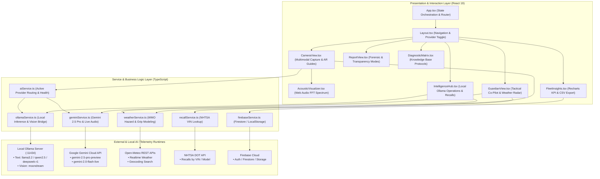

# AutoGuard AI — Detailed System Architecture

## 1. System Topology & Component Layout

## 2. Core Functional Flows

### Flow A: Multimodal Forensic Inspection
1. **Target Setup:** User specifies vehicle profile (Year, Make/Model, VIN, Mileage, Fuel Type, Calibration Class).
2. **Phase Capture:** User navigates 6 standardized phases (Front/Bumper, Side/Jambs, Engine Bay, Undercarriage/Rails, Interior/Airbags, Acoustic Idle).
3. **Acoustic FFT Ingestion:** `AcousticVisualizer.tsx` initializes `AudioContext`, attaches `AnalyserNode` (fftSize: 512, smoothing: 0.8), streams real-time frequency distribution (20Hz–20kHz) across 5 diagnostic zones, and encodes a WebM audio blob.
4. **AI Inference & Structured Synthesis:**
   - **Local Path:** `ollamaService.ts` dispatches image assets to `moondream` for optical pathology detection, synthesizes visual observations + audio signatures with `llama3.2:3b`/`qwen2.5`, and parses strict JSON matching the GDVF schema.
   - **Cloud Path:** `geminiService.ts` bundles base64 parts with `GDVF_SYSTEM_INSTRUCTION` and invokes `gemini-2.5-pro-preview` with native JSON Schema validation (`FORENSIC_RESPONSE_SCHEMA`).
5. **NHTSA Cross-Reference:** VIN (17 chars) is asynchronously queried against `api.nhtsa.dot.gov/recalls/recallsByVehicle?vin={vin}`.
6. **Persistence & Presentation:** Report is saved to Firestore (or LocalStorage `autoguard-history`) and rendered in `ReportView.tsx`.

### Flow B: Tactical Guardian GPS & Weather Avoidance
1. **Mission Initialization:** User inputs Destination, Vehicle Profile, Threat Level, and Route Priority.
2. **Meteorological Geocoding & Telemetry:** `weatherService.ts` geocodes location via Open-Meteo and queries hourly surface temperature, precipitation rate, wind gusts, and visibility.
3. **Road Surface Grip Modeling:** Computes baseline friction index (nominal 95%), subtracts risk penalties (Hydroplaning: -38%, Black Ice: -50%, Crosswinds: -15%), determines road hazard level (`OPTIMAL`, `CAUTION`, `HAZARDOUS`, `SEVERE_DANGER`), and caps safe speed.
4. **Live Guidance & Voice Co-Pilot:** Integrates Web Speech API `SpeechSynthesis` with rally-style short phrases (turn ≤ 12 words, hazard ≤ 20 words) and streams live audio bidirectional duplex via `gemini-2.0-flash-live-001` when configured.
